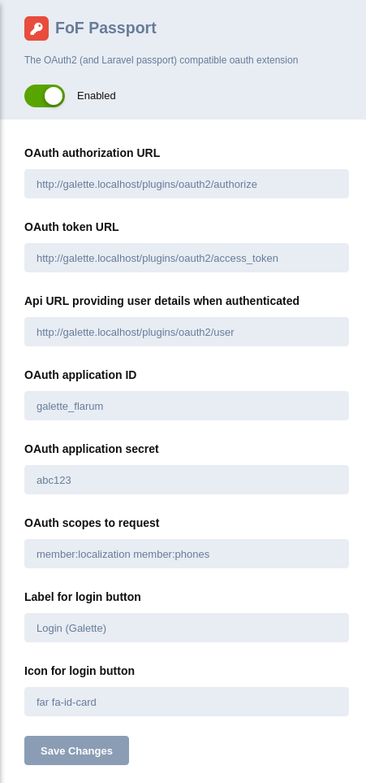
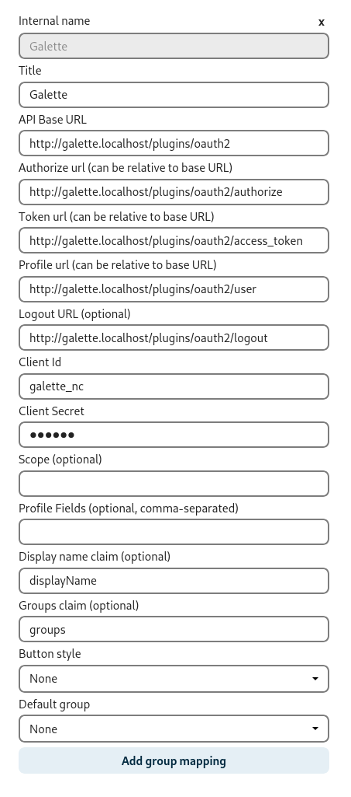
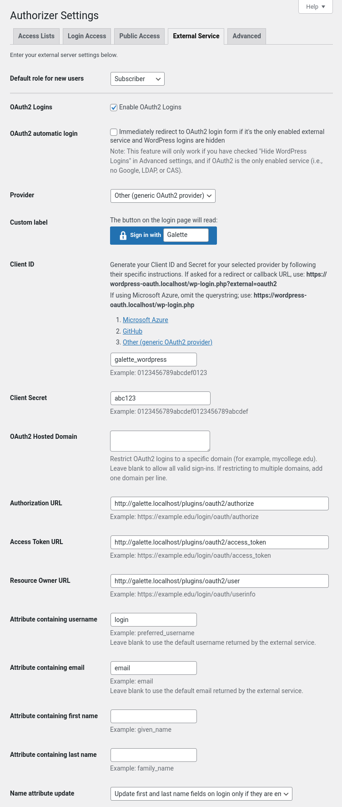
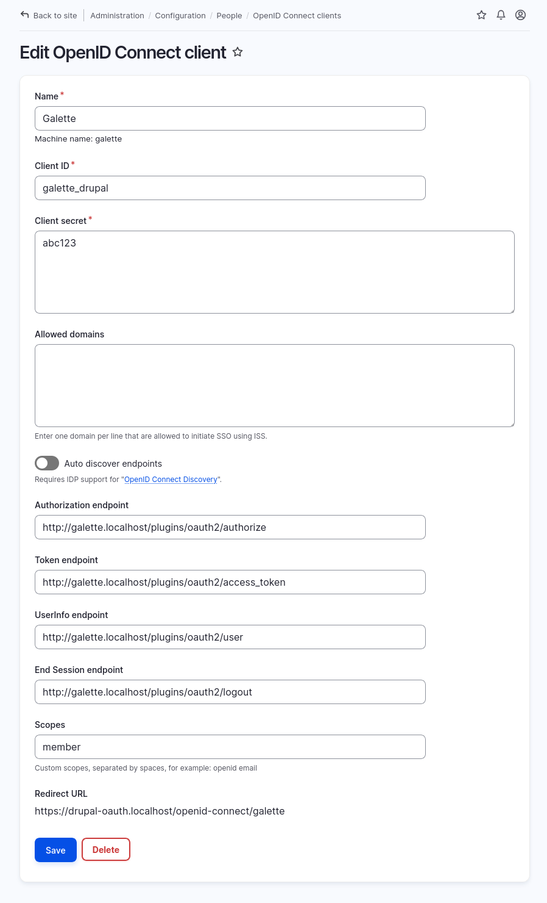
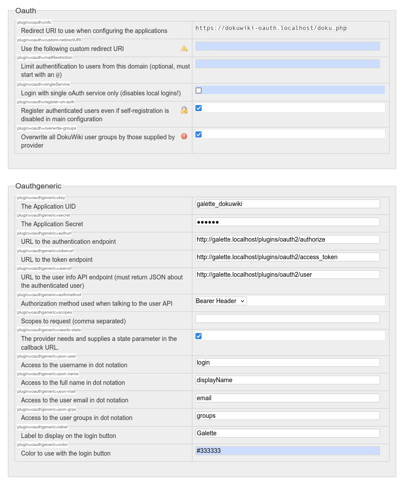

Makes Galette act as a oAuth2 server; so it is possible to use existing members to log-in on third party websites, like [Flarum](https://flarum.org/), [Nextcould](https://nextcloud.com/), and so on!

# Setup

This project use `league/oauth2-server`, `symfony/yaml` and `hassankhan/config` packages.

To automatically download these packages:
```
cd plugin-oauth2
composer install
```

# Updating to version 3.0.0

Before updating to version 3.0.0, please take care of the following:
- the existing `options` entry in configuration file has been renamed to `authorize`. Please update your configuration file accordingly.
- the `scopes` entry in configuration file has been added; some data you were previously using may be missing.
- previous versions were using non Galette data (like `username`). If you were using this data and still want to rely on them; add a `legacy_data: true` in you applications entries.
- Real Galette groups have been added to `member:groups:` scope
- Member status is no longer the first groups entry
- Groups hack from `info_adh` field has been removed
- Groups names reformatting has been removed

# Configuration

## Prepare public/private keys

```
cd plugin-oauth2/config
openssl genrsa -out private.key 2048
openssl rsa -in private.key -pubout -out public.key
chmod 660 *.key


vendor/bin/generate-defuse-key
copy-paste the hexadecimal string result in plugin-oauth2/config/encryption-key.php
```

## Configure a ClientEntity

Rename `config/config.yml.dist` to `config/config.yml` and edit according to your third party application settings:

```
global:
    password: abc123

galette_flarum:
    title: 'Forum Flarum'
    redirect_logout: 'http://192.168.1.99/flarum/public'
galette_nc:
    title: 'Nextcloud'
    redirect_logout: 'http://192.168.1.99/nextcloud'
    scopes:
        - member:groups
galette_xxxxx:
```

The corresponding Flarum configuration:



The corresponding NextCloud configuration:



The corresponding Wordpress configuration:



The corresponding Drupal CMS configuration:



The corresponding DokuWiki configuration:



### Available authorizations:

* `uptodate`: only active and up-to-date members can login
* `teamonly`: only active team members (admins, staff and groups managers)

When there is no `authorize` entry set in configuration, it defaults to "teamonly".

### Scopes

Default `member` scope will be added if it is not present in your configuration (even if you do not set any scope).
To declare multiple scopes, separate them with a space like `member member:phone member:localization`.

* `member`: default, basic scope - always included:
  * user full name,
  * login,
  * email,
  * language
  * company name if relevant
* `member:personal` precise personal data:
  * birthdate,
  * job,
  * gender,
  * birthplace
  * GPG id
* `member:localization` localization data:
  * country,
  * region,
  * town,
  * zipcode
* `member:localization:precise` precise localization data:
  * address,
  * maps plugin coordinates
* `member:phones`:
  * mobile phone
  * phone
* `member:socials`:
  * all registered social networks
* `member:groups`:
  * groups member is part of
* `member:due_date`:
  * due date

# More information about OAuth2 Server
* https://oauth2.thephpleague.com/
* https://github.com/thephpleague/oauth2-server/
